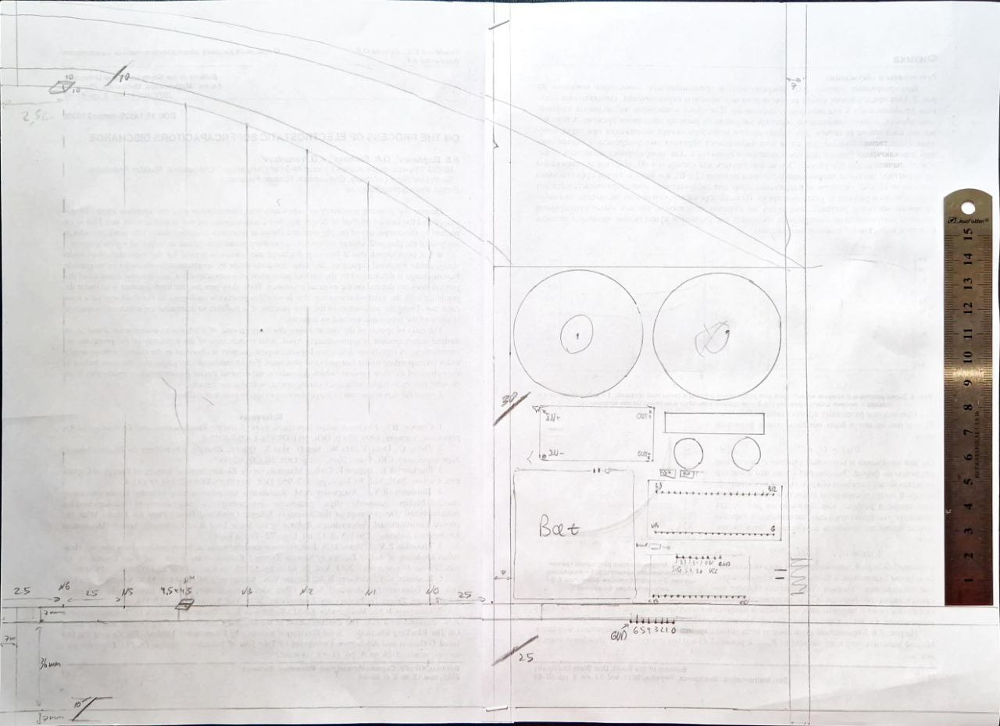
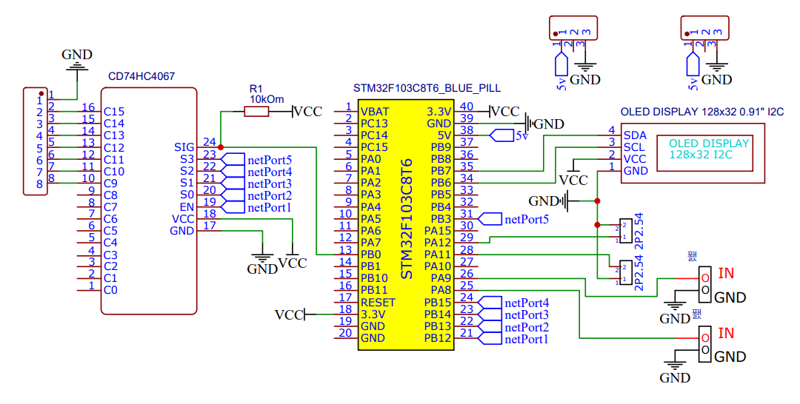
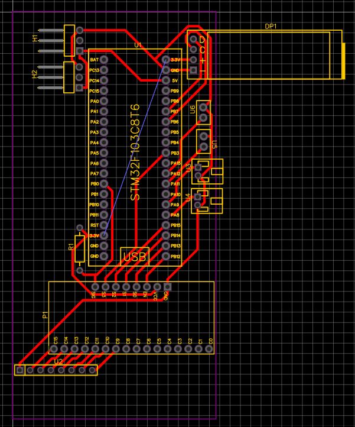
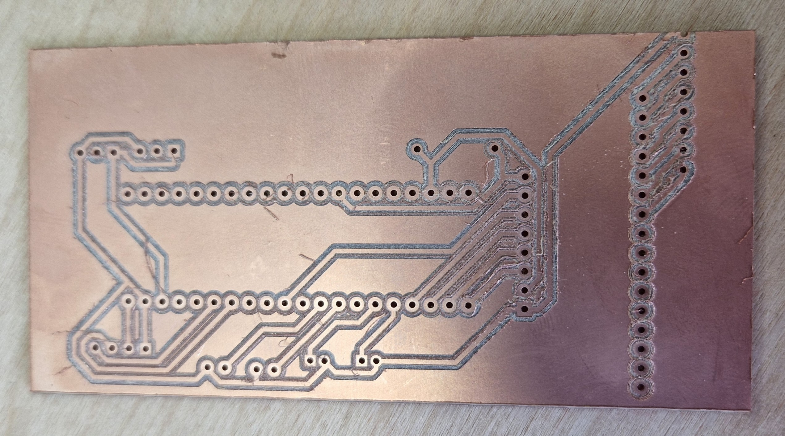
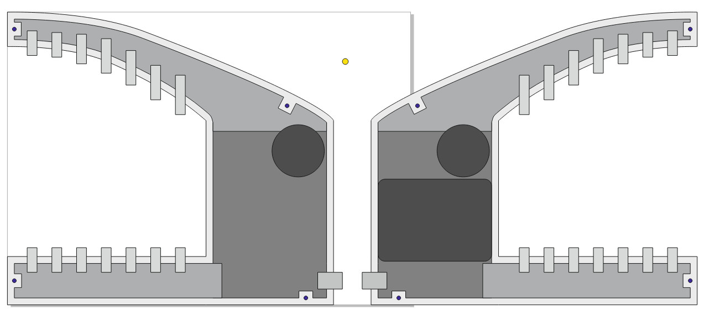
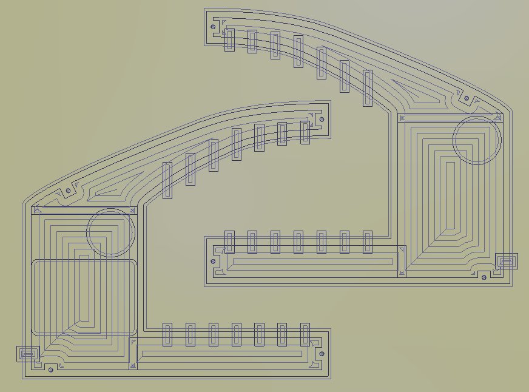
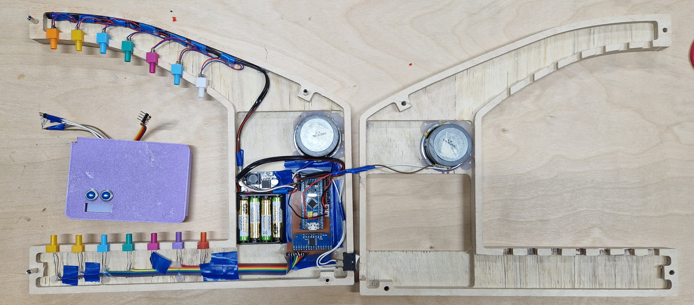
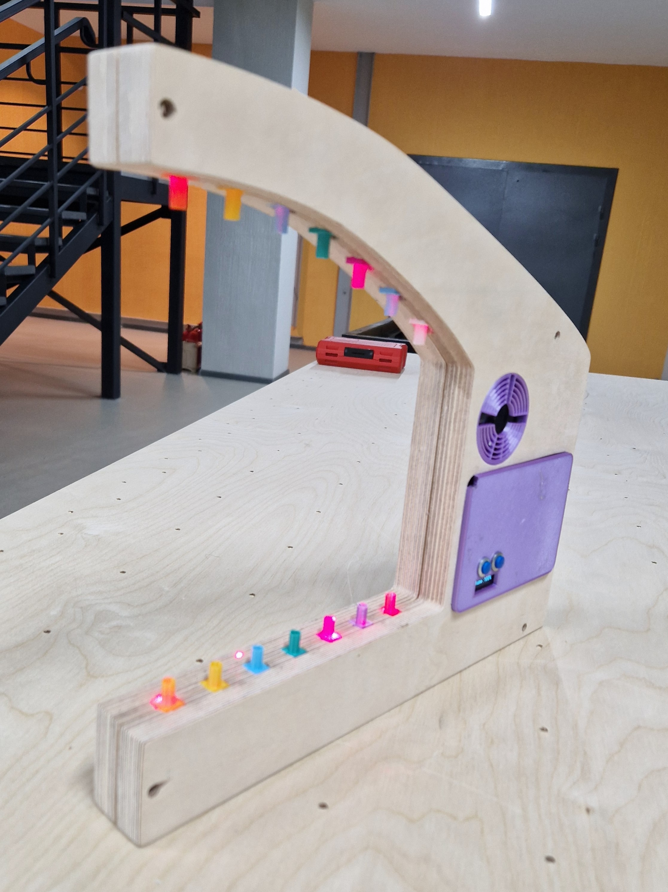
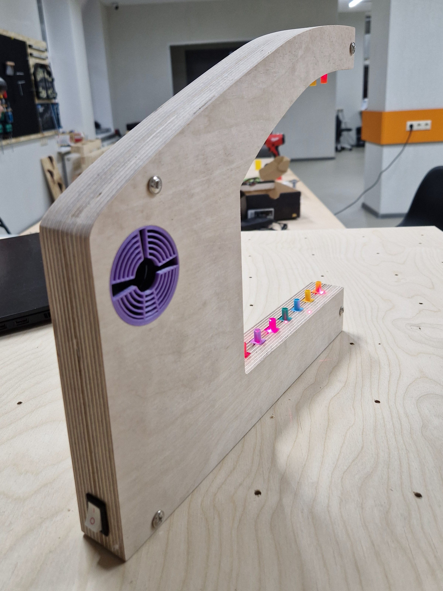
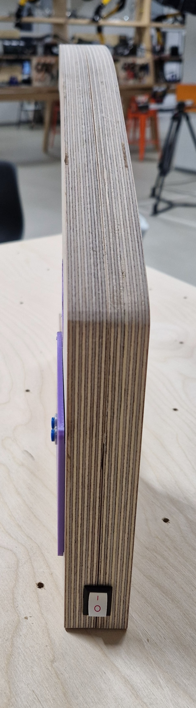

# Лазерная арфа

Рисунок 1. Изготовленная лазерная арфа

## Идея
Мы хотели разработать своего рода электронный музыкальный синтезатор, но не в привычной форме фортепьяно, а в корпусе арфы, которая использует лазеры вместо струн (рис. 1 и 2а и 2б).

Также в рамках учебного проекта у нас было желание испытать возможности бюджетного микроконтроллера STM32F103(C8T6), поэтому нами использовалось наименьшее количество вспомогательных микросхем и иных деталей.

  |  
:-------------------------:|:-------------------------:

Рисунок 2а и 2б. Лазерная арфа в представлении искусственного интелекта

## Задачи
В результате выполнения проекта стало ясно, что комплексная разработка устройства нетривиальная задача. На каждом из этапов его реализации возникает множество вопросов и появляются развилки для принятия решений. Некоторые аспекты в ходе работы были переосмыслены и изменены. Поэтому для простоты восприятия плана он будет представлены как последовательная цепочка только тех задач, выполнение которых привело нас к результату.

Процесс воплощения идеи в конечном счете разбился на достаточное количество этапов:
1. Подготовка, в которую входит скетчинг и оценка необходимых комплектующих
2. Прототипирование, то есть сборка готового устройства на макетной плате
3. Проектирование, создание точной схемы корпуса арфы с учетом расположения ее компонентов
4. Разработка и изготовление основной печатной платы
5. Разработка и производство корпуса арфы
6. Печать мелких деталей на 3D принтере
7. Предварительная сборка устройства
8. Устраненные конструктивные недоработки
9. Тестирование устройства и внесение окончательных правок

## 1 Подготовка
Первым делом были приняты ключевые решения, касающиеся дизайна (рис. 3).
> Корпус будет изготовлен из фанеры на станке с ЧПУ.
> Его основание будет плоским для устойчивости.
> Изделие будет состоять из двух половин с обработанными в них углоблениями. Таким образом получим полость в корпусе для размещения компонентов.
> Также "вертикальная" часть должна быть значительно толще "горизонтальных" для размещения в ней сервисного окна и значительной части электроники.
Так как конечный дизайн сильно зависит от используемых компонент, то набросок был выполнен быстро и небрежно. Малая толщина устройства (около 4 см) вынуждает рационально использовать внутреннее пространство из-за чего и возникает привязка внешнего вида к электронным компонентам.

Рисунок 3. Первый набросок дизайна

Далее мы определились с будущими компонентами арфы:

| Компонент | Конкретная деталь | Причина ее выбора |
| ------ | ------ | ------ | 
| Микроконтроллер | STM32F103C8T6 | Это бюджетый и один из самых популярных МК, его можно быстро купить. Также он обладает достаточными как вычислительной мощностью, так и набором периферии. Выбрана плата Blue Pill c алиэкспресс. |
| Лазеры (7 штук) | - | Подойдет любой лазер, нами была выбрана модель с размерами d6x13,5 мм, генерируемым излучением красного цвета (650 нм), напряжением питания 3-5 В и мощностью 5 мВт |
| Фоторезисторы (7 штук) | GL5506 | Конкретная модель не важна, однако от нее будут зависить подбирвемый для измерений резистор и настроечные коэффициенты в программе. Размер 5x4,3x2 мм, сопротивление освещенности 2-5 КОм, темноты - 0,2 МОм. |
| Резистор | 10 КОм | Его сопротивление соизмеримо с рабочим сопротивленим фоторезисторов, что позволяет измерять падение напряжение на нем при последовательном соединении с датчиком освещенности, это позволяет расчитать текущее сопротивление последного.  |
| Мультиплексор | CD74HC4067 | Имеет 16 входов (достаточно 7) и позволяет пропускать аналоговый сигнал с током, не превышающим 25 мА. |
| Динамики (2 штуки) | От сломной китайской колонки | Подойдут любые не слишком громоздкие динамики. |
| Батарейный модуль | 4xAAA | Должны быть соеденины 4 или более батарей последовательно, чтобы выходное напряжение при свежих батареях было не менее 6 В (и не более 20 В). |
| Понижающий DC-DC трансформатор | LM2596 | Выдает фиксированное напряжение 5 В. |
| Аккумулятор | li-pol 300 mAh | Подойдет любой, так как выходная мощность практически не зависит от емкости. |
| Контроллер зарядки АКБ | TP4056 | Подойдет любой. В проекте выбрана версия с разъемом USB type C. |
| Дисплей | 0,91 inch I2C OLED module, driver SSD1306 | Для управления достаточно двух проводов I2C. |
| Кнопка включения с фиксацией | - | Для включения устройства. |
| Кнопки без фиксации (2 штуки) | - | Для управление настройками арфы. |
| Связующий | Провода, изолента и клеевой пистолет | Тут все ясно |

## 2 Прототипирование

Второй этап разработки лазерной арфы заключался в параллельных процессов сборки устройства на макетной плате и программирования. В результате мы получили функционирующее устройство (рис. 4). Подробная электрическая схема будет изображена в пункте №4, посвященному изготовлению печатной платы. Сейчас стоит обратить внимание на использованные модули микроконтроллера.

В первую очередь рассмотрим GPIO порты:
- PA11, PA12 настроены на режим Input c подтяжкой к питанию. Они используются для детекции нажатия двух кнопок управляния, подсоединенных к земле.
- PC13 настроен на Output. И использовался для отладки кода, так как подсоединен к светодиоду на корпусе МК.
- PB3, PB12, PB13, PB14, PB15 настроенты на Output и применяются для управления мультиплексором, который выбирает фоторезистор для подключения к схеме.
Также мы использовали еще четыре пина:
- PB0 настроен на Analog и дает возможность измерять напряжение на выбранном мультиплексором фоторезисторе, что позволяет оценивать освещенность конкретного датчика.
- PB6, PB7 в режиме I2C и реализуют взаимодействие с дисплеем.
- PA8, PA9 являются двумя каналами одного PWM. Сигналы на них идентичные, но выводятся на два разных динамика.

Для управления всей переферией потребовалось использование всех доступныъ 4ех таймеров STN32F103. Рассмотрим их применение:
- TIM1 как самый "продвинутый" таймер был выбран для генерации PWM cигнала. Он не вызывает никаких прерываний, взаимодействие с ним ограничивается изменением значения регистра счетка, отвечающего за глубину модулирования сигнала.
- TIM2 вызывает прерывание для обновления состояния струн. В этом процессе последовательно измеряются напряжения на каждом из фоторезисторов и, если занчение велико, что соотвествует низкой освещенности датчика, то струна помечается в глобальном массиве задетой. 
- TIM3 имеет наибольший приоритет и увеличивает глобальный счетчик времени на единицу раз в миллисикунду, что позволяет контролировать реальное время. Это важно для расчета затухания.
- TIM4 имеет наименьший приоритет и по прерыванию обрабатывает нажатия кнопок. В случае нажатия хотя бы одной из них проиходит обработка и обновление экрана.
> Важно обновлять экран только в случае изменения параметров. В противном случае его обновление будет происходить слишком часто, а это медленный процесс, что вызовет зависание исполнения программы. 

Рисунок 4. Фото используемых всех компонент за исключением источников питания, кнопок и динамиков

## 3 Проектирование корпуса

В ходе третьего этапа, зная все используемые комплектующие, мы подготовили подробную полноразмерную схема одной половины корпуса (рис. 5). Чертеж учитывает размер каждой из компонент.

> Стоит обратить внимание на шлейф фоторезисторов. Он имеет фиксированную длину, а 8ми пиновый коннектор уже припаян, поэтому особенно важно учесть место подключения датчиков и разместить остальные детали относительно него.  

Рисунок 5. Схема одной половины корпуса

## 4 Изготовление печатной платы

Четвертый этап заключается в разработке печатной платы. Сначала в онлайн программе EasyEDA нужно повторить электрическую схему устройсва (рис. 6), а после произвести разводку платы (рис. 7). 
> Важно учесть не только особенности корпусо, но и размеры доступных кусков текстолита, нами был выбран 50x100 мм.

 | 
:-------------------------:|:-------------------------:
Рисунок 6. Электрическая схема печатной платы | Рисунок 7. Разводка печатной платы

Дальнейшим шагом является экспорт проекта в Gerber файлы и преобразование из в GCode для фрезерного станка Charly4U при помощи программы FlatCAM. После чего непосредственно изготавливаем плату (рис. 8) в два этапа: фрезеровка дорожек и сверление отверстий для крепления деталей. 

Рисунок 8. Изготовленная печатная плата

После изготовления требуется убрать лишние остатки стружки на плате, чтобы она не привила к замыканию устройства. 

## 5 Производство корпуса арфы

Пятым шагом является изготовления основной части корпуса арфы из фанеры. Для этого нужно перенсти чертеж в цифровой векторный формат (мы использовали Corel IDraw), создать его симметричную копию для второй половины, в которой сделаем прямоугольный вырез для сервисного окна. Далее разобъем векторные контуры на группы по глубине требуемой гравировки (рис. 9). Также доболнительно добавим четре квадратные площадки, которые не будут фрезероваться, в них нужно будет просверлить отверстия для мебельных стяжек, требуемых для сборки двух половин. 

> При раскройке чертежа важно учесть форму фрезы, она круглая, поэтому требуется делать "нахлесты" внутренних контуров, чтобы фреза могла полностью обработать прямоугольные углы.

Следом требуется подготовка файла к производству, для этого загрузим векторы в ArtCAM, где создадим GCode с учетом доступного интрумента. Перед загрузки программы непосредсвенно в фрезерный станок FlexiCAM самостоятельно проконтроллируем корректность трассировки (рис. 10) программы.

 | 
:-------------------------:|:-------------------------:
Рисунок 9. Чертеж корпуса в векторном формате | Рисунок 10. Трассировка программы фрезерования 

В результате изготовления мы получили две половины корпуса (рис. 11), которые нужно в последсвии доработать: убрать торчащие остатки волокон и обработать наждачкой внешние края. После чего можно стянуть обе половины корпуса для проверки его собранного вида (рис. 12). 

 | 
:-------------------------:|:-------------------------:
Рисунок 11. Фанера после обработки фрезерным станком | Рисунок 12. Изготовленный корпус 

## 6 Изготовление маленьких деталей на 3D принтере

Часть деталей в виду своей миниатюрности или сложности следует изготовить на 3D принтере. Этот процесс многим известен и не представляет особого интереса, поэтому подробного его описание не последует. Всего было создано четыре модели.

Файл 3D модели | Содержимое
:-------------------------:|:-------------------------:
`.\3d-printer\face-panel.m3d` | Крышка для сервисного окна с прямоугольным отверстием под экран и двумя круглыми - под кнопки
`.\3d-printer\laser-steer.m3d` | Направляющая лазер деталь с декоративным соплом на выходе
`.\3d-printer\photoresistor-steer.m3d` | Направляющая фоторезистор деталь с декоративным соплом на выходе
`.\3d-printer\speaker-grid.m3d` | Решетка для динамика

После были изготовлены: одна крышка, две решетки и по семь штук каждой из направляющих. Их фотографии в следуещем разделе, посвященнос сборке устройста.

## 7 Предварительная сборка устройства

После производства всех деталей можно приступать к сборке. Сначала нужно разместить все пластиковые детали в корпусе арфы, если в какое-либо из отверстий они не помещаются, то нужно обработать это место стамеской. Как только мы убедились, что корпус без электроники собирается, можно приступить к пайке печатной платы и всех остальных компонент, в частности кнопки включения, АКБ, батарейного отсека и понижающего трансформатора. Для фиксации компонентов внутри корпуса используем клеевой пистолет (рис. 13).

Рисунок 13. Закрепленные в корпусе арфы компоненты (без АКБ)

## 8 Устраненные конструктивные недоработки

При разработке лазерной арфы было две значительные недоработки, которые пришлось устранить.

Первая проблема заключается в системе крепления лазеров. Корпус состоит из двух половин, между которыми устанавливается направляющая, внутри которой свсободной пространство для крепления лазера. Большое количество степеней свободы представляет трудность при настройки лазеров, которую мы производили в три этапа (рис. 14абв). Первый - поиск наиболее устойчивого положения для направляющих лазеров в одной половине арфы и фиксация их в этой позиции путем добавления к краям деталей маленьких кусочков изоленты для увеличения толщины изделий. Второй - крепление лазеров: клеевым пистолетом выдавливалось небольшое количество силиконовой массы в направляющую, после туда помещался работающий лазер и направлялся в центр фоторезистора, далее требовалось выждать некоторое время для фиксации детали перед ее отпусканием. Третий - после соединения двух половин корпуса направляющие очередной раз немного смещаются, для корректировки их положения мы разогревали их феном и размягченному пластику задавали новое положение.     

 |  | 
:-------------------------:|:-------------------------:|:-------------------------:

Рисунок 14 а, б, в. Изготовленная арфа до корректрировки положений лазеров 

Вторая ошибка несла критический характер. При тестировании устройства на макетной плате микроконтроллер получал дополнительное питание от ноутбука через программатор, поэтому питание электрической цепи было стабильное и проблем не наблюдалось. Но после сборки изделия выяснилось, что батарейки не могут выдать достаточный ток и работа динамиков влияла на интенсивность лазеров, за счет чего происходили ложные срабатывание системы обработки перекрытия лазера. Для решения этой проблемы пришлось отделить систему питания лазерво от остальной электроники. В текущей версии лазеры работают от батарее, в то время как МК с динамиками запитываются от отдельного li-pol АКБ. Также пришлось перепаять кнопку включения: чтобы оба устройства питания включались одновременно, их земли были объеденины и размыкались одной кнопкой. 

## 9 Тестирование устройства

После доработок устройство работало без каких-либо проблем. Каждая струна срабатывает, громкость арфы и ее октава успешно изменяются. Это продемонтрировано в видео ниже.

https://github.com/xKobi74/laser-harp/assets/91433586/09fca46d-aad3-4e3c-a627-9d7ef02587f8
