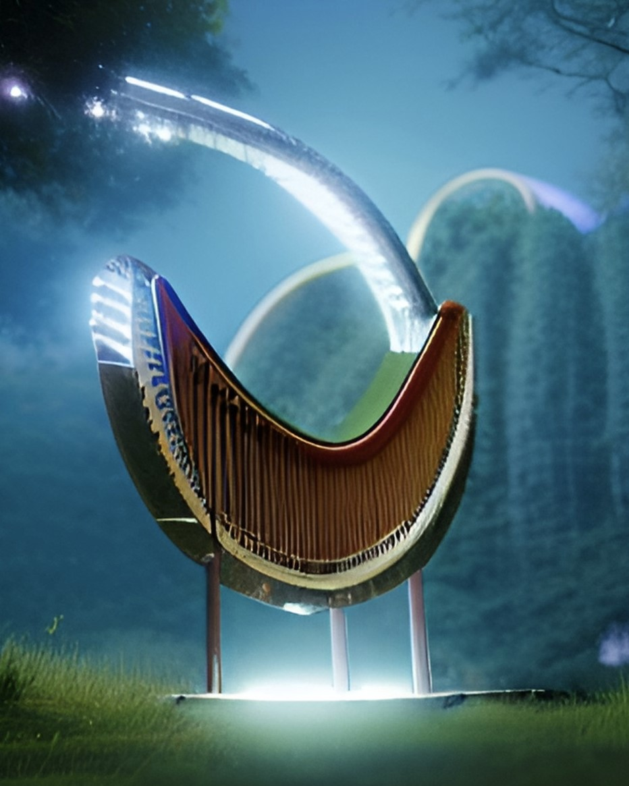
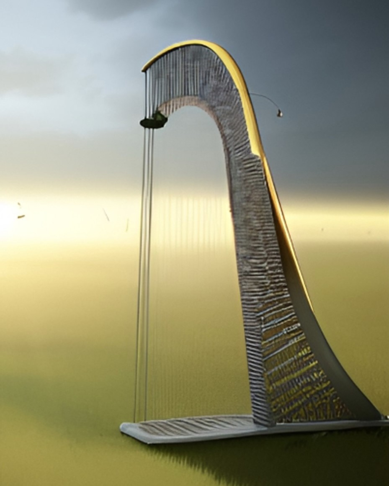
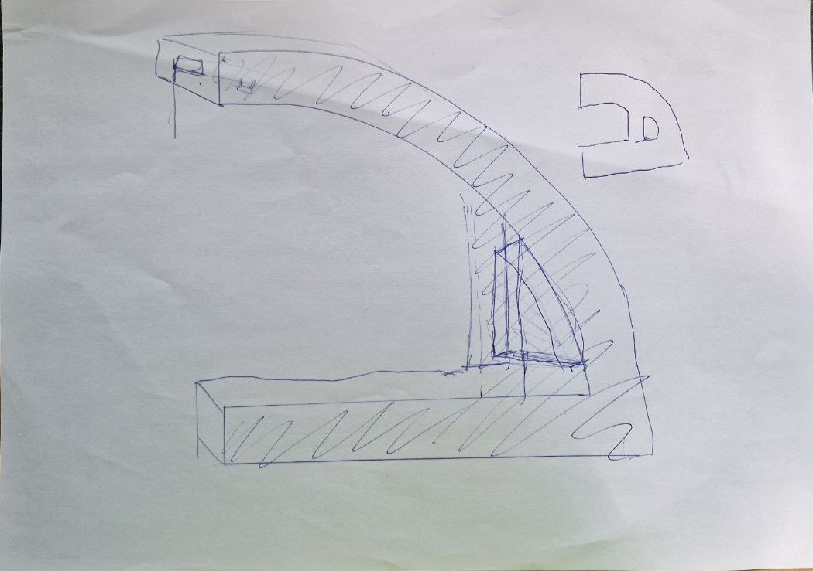

# Лазерная арфа

Рисунок 1. Изготовленная лазерная арфа

## Идея
Мы хотели разработать своего рода электронный музыкальный синтезатор, но не в привычной форме фортепьяно, а в корпусе арфы, которая использует лазеры вместо струн (рис. 1 и 2а и 2б).

Также в рамках учебного проекта у нас было желание испытать возможности бюджетного микроконтроллера STM32F103(C8T6), поэтому нами использовалось наименьшее количество вспомогательных микросхем и иных деталей.

  |  
:-------------------------:|:-------------------------:

Рисунок 2а и 2б. Лазерная арфа в представлении искусственного интелекта

## Задачи
В результате выполнения проекта стало ясно, что комплексная разработка устройства нетривиальная задача. На каждом из этапов его реализации возникает множество вопросов и появляются развилки для принятия решений. Некоторые аспекты в ходе работы были переосмыслены и изменены. Поэтому для простоты восприятия плана он будет представлены как последовательная цепочка только тех задач, выполнение которых привело нас к результату.

Процесс воплощения идеи в конечном счете разбился на достаточное количество этапов:
1. Подготовка, в которую входит скетчинг и оценка необходимых комплектующих
2. Прототипирование, то есть сборка готового устройства на макетной плате
3. Проектирование, создание точной схемы корпуса арфы с учетом расположения ее компонентов
4. Разработка и изготовление основной печатной платы
5. Разработка и производство корпуса арфы
6. Печать мелких деталей на 3D принтере
7. Предварительная сборка устройства
8. Устранение конструктивных недоработок
9. Тестирование устройства и внесение окончательных правок

## 1 Подготовка
Первым делом были приняты ключевые решения, касающиеся дизайна (рис. 3).
> Корпус будет изготовлен из фанеры на станке с ЧПУ.
> Его основание будет плоским для устойчивости.
> Изделие будет состоять из двух половин с обработанными в них углоблениями. Таким образом получим полость в корпусе для размещения компонентов.
> Также "вертикальная" часть должна быть значительно толще "горизонтальных" для размещения в ней сервисного окна и значительной части электроники.
Так как конечный дизайн сильно зависит от используемых компонент, то набросок был выполнен быстро и небрежно. Малая толщина устройства (около 4 см) вынуждает рационально использовать внутреннее пространство из-за чего и возникает привязка внешнего вида к электронным компонентам.

Рисунок 3. Первый набросок дизайна

Далее мы определились с будущими компонентами арфы:

| Компонент | Конкретная деталь | Причина ее выбора |
| ------ | ------ | ------ | 
| Микроконтроллер | STM32F103C8T6 | Это бюджетый и один из самых популярных МК, его можно быстро купить. Также он обладает достаточными как вычислительной мощностью, так и набором периферии. Выбрана плата Blue Pill c алиэкспресс. |
| Лазеры (7 штук) | - | Подойдет любой лазер, нами была выбрана модель с размерами d6x13,5 мм, генерируемым излучением красного цвета (650 нм), напряжением питания 3-5 В и мощностью 5 мВт |
| Фоторезисторы (7 штук) | GL5506 | Конкретная модель не важна, однако от нее будут зависить подбирвемый для измерений резистор и настроечные коэффициенты в программе. Размер 5x4,3x2 мм, сопротивление освещенности 2-5 КОм, темноты - 0,2 МОм. |
| Резистор | 10 КОм | Его сопротивление соизмеримо с рабочим сопротивленим фоторезисторов, что позволяет измерять падение напряжение на нем при последовательном соединении с датчиком освещенности, это позволяет расчитать текущее сопротивление последного.  |
| Мультиплексор | CD74HC4067 | Имеет 16 входов (достаточно 7) и позволяет пропускать аналоговый сигнал с током, не превышающим 25 мА. |
| Динамики (2 штуки) | От сломной китайской колонки | Подойдут любые не слишком громоздкие динамики. |
| Батарейный модуль | 4xAAA | Должны быть соеденины 4 или более батарей последовательно, чтобы выходное напряжение при свежих батареях было не менее 6 В (и не более 20 В). |
| Понижающий DC-DC трансформатор | LM2596 | Выдает фиксированное напряжение 5 В. |
| Аккумулятор | li-pol 300 mAh | Подойдет любой, так как выходная мощность практически не зависит от емкости. |
| Контроллер зарядки АКБ | TP4056 | Подойдет любой. В проекте выбрана версия с разъемом USB type C. |
| Дисплей | 0,91 inch I2C OLED module, driver SSD1306 | Для управления достаточно двух проводов I2C. |
| Кнопка включения с фиксацией | - | Для включения устройства. |
| Кнопки без фиксации (2 штуки) | - | Для управление настройками арфы. |
| Связующий | Провода, изолента и клеевой пистолет | Тут все ясно |
